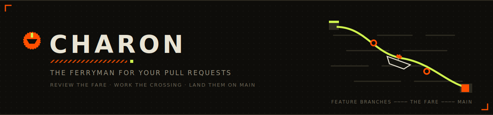
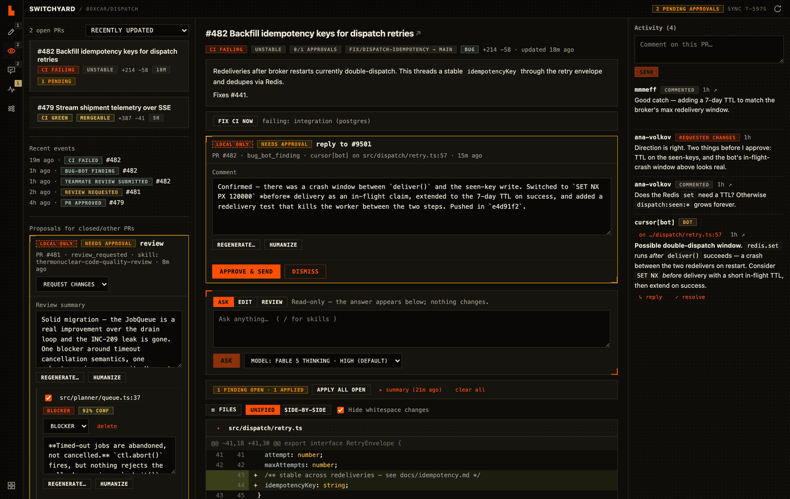
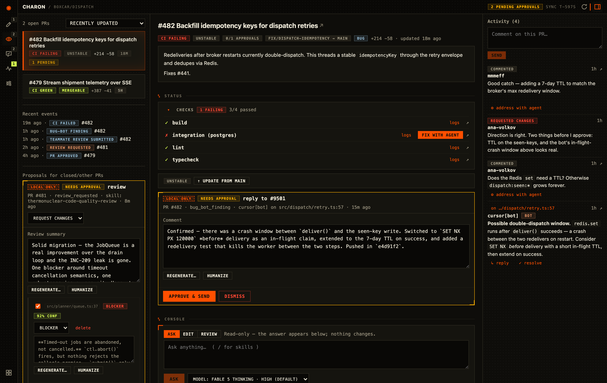
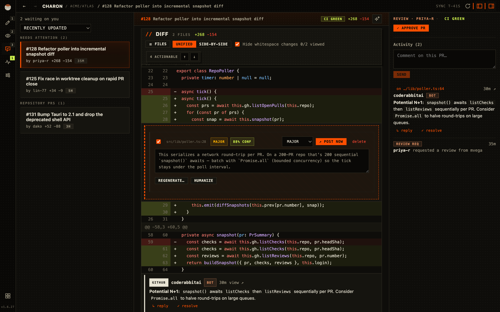
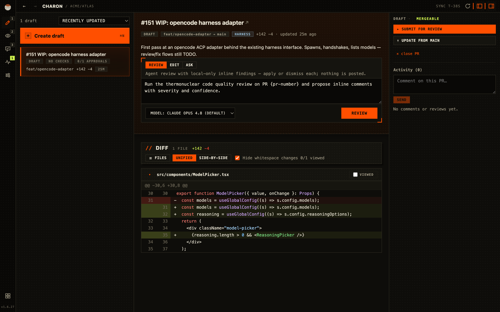
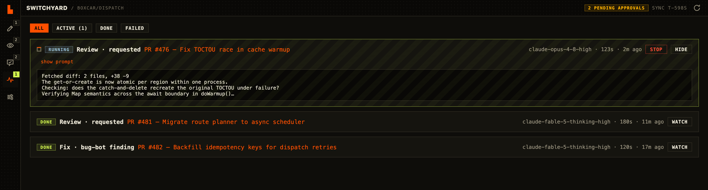
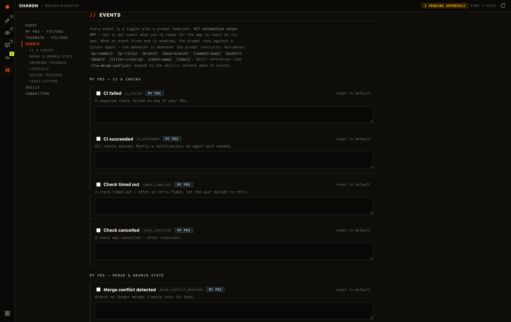
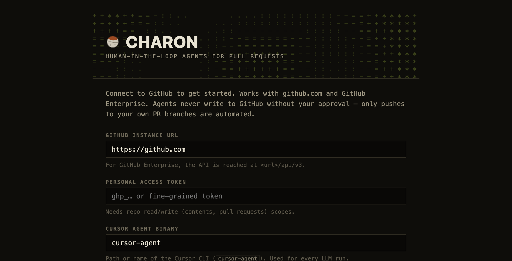

<p align="center">
  
</p>

<p align="center">
  <a href="https://charon.sh"><b>charon.sh</b></a> · <a href="../../releases/latest">Download for macOS</a>
</p>

<p align="center">
  <a href="LICENSE"></a>
  
  
  
  
  
</p>

AI made writing code cheap. It didn't make *merging* it cheap: the PRs got bigger, more numerous,
and more uneven, while review capacity — humans with context and accountability — stayed exactly
the same. That's the new bottleneck, and the popular fix (point another unsupervised bot at the
thread) just moves the noise downstream to the people who have to read it.

**Charon is a desktop control room for that bottleneck.** It watches every PR you own and every
review you owe, fires agents at the work that doesn't need your judgment — failing CI, merge
conflicts, bug-bot triage, first-pass review — and turns what *does* need your judgment into
fast, well-presented decisions: **proposals you edit and approve before anything touches GitHub**.

<p align="center">
  
</p>

## Tools for the human in the loop

You can't fix an AI-volume problem by adding more unsupervised AI output — auto-posted reviews and
auto-replies are how PR threads became unreadable in the first place. Charon spends its
intelligence the other way: agents do the legwork, and the product of every run is a *decision
surface* for you — diffs with anchored findings, severity and confidence on every comment,
one-click apply-or-dismiss — instead of another post in the thread.

- **The app never posts comments, replies, or reviews on its own.** Every GitHub-facing write is a
  proposal card — edit it, regenerate it with a custom prompt, run it through a humanize skill, or
  dismiss it. Nothing ships until you hit *Approve & send*. Your teammates always get *you*, at
  your speed, not a bot wearing your name.
- **One automated exception, by design:** during fix flows the agent commits and pushes to *your
  own* PR branches (never forks, never teammates' branches). Code is reviewable after the fact;
  comments that impersonate you are not.
- Agents reviewing teammates' code run **read-only**. Fix agents get an **isolated git worktree**
  scoped to the one PR they're fixing.

## What it does

### Babysits your open PRs

A per-repo poller snapshots checks, mergeability, comments, and reviews, then diffs the snapshots
into **events**: `ci_failed`, `merge_conflict_detected`, `bug_bot_finding`,
`teammate_review_submitted`, and twenty more. Each event runs your prompt against the coding agent
of your choice — the default playbook fixes CI, resolves conflicts, and triages bot findings before you've finished
your coffee. Self-review findings (severity- and confidence-tagged, with concrete suggestions) land
anchored on the diff, one *Apply* away from a fix agent.



### Drafts reviews you'd actually send

When a teammate requests your review, an agent reads the full diff and drafts inline comments —
each with severity, confidence, and an editable body — anchored on a native diff view with file
tree, unified/split modes, and resolvable threads. Toggle comments off, rewrite them, change the
verdict, then submit the whole review in one shot.



### Treats your drafts as a workspace

GitHub-style click-and-drag line selection on your draft PRs. Select lines and *Edit* — an agent
implements the change in a worktree and pushes. Ask a question instead and it answers read-only.
Your draft, no approval gate, full speed.



### Shows you everything the agents do

Every run — its prompt, model, working directory, and live streamed output — in one feed. Stop a
runaway agent with one click.



### And every behavior is a prompt you own

Every event handler is a toggle plus a prompt template. Don't like how the CI-fix prompt reads?
Edit it. Want conflict resolution off for one repo? Toggle it. Per-repo filters (labels, drafts,
freeform LLM criteria) decide what's worth an agent's attention. New event types are catalog
entries — the engine never changes.



## Bring your own agent

Charon talks to coding agents over the [Agent Client Protocol](https://agentclientprotocol.com)
(ACP) — the open JSON-RPC standard for editor↔agent communication. Any ACP-speaking harness drops
in behind the same `event -> { enabled, prompt }` interface, with its models, reasoning levels, and
tool calls surfaced natively in the UI. Onboarding walks you through picking one and verifies the
connection live. Supported out of the box:

| Harness | How it connects | Notes |
| --- | --- | --- |
| **[Cursor](https://cursor.com/cli)** | `cursor-agent acp` | Native ACP server. Run `cursor-agent login` first. |
| **[Claude Code](https://github.com/anthropics/claude-code)** | `npx -y @zed-industries/claude-code-acp` | Adapter; needs `ANTHROPIC_API_KEY`. |
| **[Codex CLI](https://github.com/openai/codex)** | `npx -y @zed-industries/codex-acp` | ACP bridge; uses your Codex login / `OPENAI_API_KEY`. |
| **[opencode](https://opencode.ai)** | `opencode acp` | Native ACP server. Configure a provider/API key first. |

Switch harnesses any time from Settings — each keeps its own model and reasoning preferences. Got
another ACP agent? Point Charon at any command and it'll probe it for models and modes.
**Contributions for more harnesses are very welcome** — open an issue or PR.

## How it works

- **Stack:** Tauri 2 shell (Rust backend for HTTP, git, process spawning) + React/TypeScript front
  end. One window per repo, each with its own poller and locally-stored config.
- **Events:** every handler is `event -> { enabled, prompt }`. Prompts interpolate variables
  (`{pr-number}`, `{check-name}`, `{comment-body}`, …) and `/skill-name` references.
- **Agents:** every run is an [ACP](https://agentclientprotocol.com) session — Charon spawns the
  harness as a subprocess and speaks newline-delimited JSON-RPC over stdio, streaming `session/update`
  notifications into the live feed (tool calls, plans, reasoning) and steering or cancelling mid-run.
  Fix/draft runs get a dedicated worktree in write mode; review/Q&A runs use read-only ask mode.
- **Skills:** imported from `~/.cursor/commands`, `~/.cursor/skills`, and any directories you add.
  `humanize` and `thermonuclear-code-quality-review` ship as built-in fallbacks. Skills are
  selectable per stage (review / fix / draft / rewrite).
- **GitHub:** works against github.com and GitHub Enterprise (`<url>/api/v3`), REST + a dash of
  GraphQL for review-thread resolution. Fine-grained PAT recommended.

## Getting started

**Download:** grab the latest macOS DMG (universal — Apple Silicon + Intel) from
[Releases](../../releases/latest). Builds are code-signed and notarized, so it opens like any
other app. You'll need at least one supported agent harness installed and logged in (Cursor, Claude
Code, Codex CLI, or opencode — see [Bring your own agent](#bring-your-own-agent)); onboarding helps
you pick one and verifies it.

**Or build from source** — prerequisites: **Node 18+**, **Rust (stable)**, and a supported harness:

```sh
npm install
npm run tauri dev      # development
npm run tauri build    # packaged app
```

Releases are fully automatic: every push to `main` [auto-bumps the version](.github/workflows/version.yml)
(patch by default; put `#minor` or `#major` in a commit message — or use `feat:` / `feat!:` — to bump
further), tags it, and the [release workflow](.github/workflows/release.yml) builds and publishes the
universal DMG with an auto-generated changelog. Installed apps **self-update**: Charon checks for new
releases in the background, downloads them, and offers a one-click restart.

<p align="center">
  
</p>

On first boot, point it at your GitHub instance (github.com or a GHE URL) and a personal access
token with repo contents + pull-request read/write. Add repos by `owner/name` — each opens in its
own window.

## Trust & limitations

- The GitHub token is stored in the app data dir as plain JSON
  (`~/Library/Application Support/com.prcopilot.app` on macOS). Prefer a fine-grained token scoped to
  the repos you add, but classic tokens work too if you need broader access/permissions.
- Fork-sourced PRs are never pushed to — fix flows refuse them; only same-repo branches count as
  "your own".
- The watcher runs while a repo window is open (poll interval configurable, default 60s).

## License

[MIT](LICENSE) © Matt Frey
